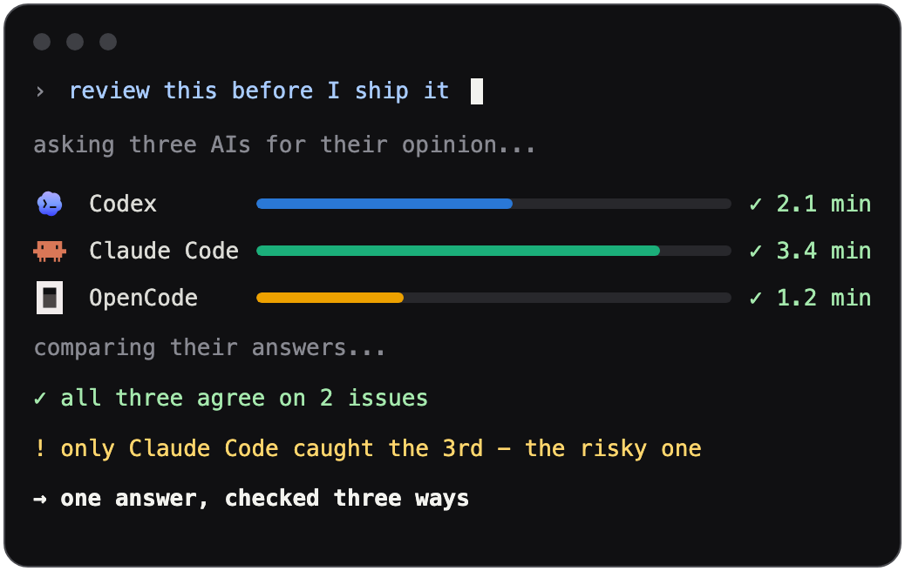

<div align="center">

<a href="https://ennodia.cherninlab.com">
<picture>
  <source media="(prefers-color-scheme: dark)" srcset="docs/assets/logo-dark.svg">
  <source media="(prefers-color-scheme: light)" srcset="docs/assets/logo.svg">
  
</picture>
</a>

<p><strong>MCP server for multi-agent review with Compare and traceable receipts</strong></p>

<p>
  <a href="LICENSE"></a>
  
  <a href="https://smithery.ai/servers/cherninlab/ennodia"></a>
</p>

<p align="center">
  
</p>

</div>

No single model or agent should be the only reviewer for work that matters.
Ennodia lets your primary agent ask the installed agent CLIs you already have,
track every child task, and use model-led Compare to surface agreements,
disagreements, blind spots, and one synthesized answer with receipts.

The subscription-pool idea is secondary: if you already pay for Codex, Claude
Code, Antigravity, OpenCode, and other local agent tools, Ennodia gives your
main agent one MCP doorway to use them as an independent review panel. The
experimental IO package exposes a small local HTTP subset for apps, but the
supported first-class surface is MCP.

## Install

Send this to your primary agent and let it handle setup:

```text
try-ennodia.cherninlab.com
```
Or run it directly as a stdio MCP server from npm:

```sh
npx -y ennodia
```

Prefer a registry or client installer? Use the
[Ennodia Smithery listing](https://smithery.ai/servers/cherninlab/ennodia).
It uses the same stdio command from `smithery.yaml` (`npx -y ennodia`) and
does not need Ennodia-specific configuration.

Requires Bun `1.3.14` or newer — `npx` downloads Ennodia, Bun runs it. Prefer
Bun directly? Use `bunx ennodia`. For manual setup, local development,
or a full walkthrough, see
[Quickstart](https://ennodia.cherninlab.com/docs/getting-started/).

## What Ennodia does

- Discovers available local AI tools
- Plans a route with a caller-provided category or keyword fallback
- Estimates preflight input tokens and enforces local caps on that estimate
- Starts and monitors child tasks
- Shows status, timing, logs, and failures
- Cancels tasks and runs explicitly
- Compares multiple completed outputs
- Synthesizes one answer from the comparison

The main entrypoint is `ennodia_run`: it plans, executes, optionally
compares, and returns a run ID to poll with `ennodia_get_run`. See
[MCP tools](https://ennodia.cherninlab.com/docs/reference/mcp-tools/) for the
full tool and parameter reference.

Ennodia is for deliberation-class work: a run usually takes minutes, and Compare
adds two serial model passes after the child agents finish.

## Ennodia IO

The separate `@cherninlab/ennodia-io` workspace package exposes a local HTTP and TypeScript interface for apps that want BYOK-style settings over installed local agents:

```sh
npx -y @cherninlab/ennodia-io
```

See [Ennodia IO](https://ennodia.cherninlab.com/docs/reference/ennodia-io/) for
supported fields, auth behavior, CORS posture, and current limits.

## Supported harnesses

- Codex CLI
- Claude Code
- OpenCode
- Kilo Code
- Kiro CLI
- Cline CLI
- Hermes Agent
- Antigravity

Adapters stay thin — shared routing, tracing, task state, recovery, and
Compare logic live in core modules.

Evaluated-but-not-shipped candidates include Gemini CLI, GitHub Copilot CLI,
Amp, Aider, Goose, Qwen Code, and Cursor CLI. They will be added only when a
supported non-interactive prompt-in/text-out surface can be verified without
permission-bypass flags or provider-private APIs.

## Documentation

- [Installation for Agents](https://ennodia.cherninlab.com/docs/install/) — the agent-driven setup path
- [Quickstart](https://ennodia.cherninlab.com/docs/getting-started/) — manual setup and local development
- [MCP Tools](https://ennodia.cherninlab.com/docs/reference/mcp-tools/) — full tool parameter reference
- [How Ennodia Works](https://ennodia.cherninlab.com/docs/concepts/how-ennodia-works/) — the orchestration pipeline
- [Second Opinions](https://ennodia.cherninlab.com/docs/concepts/second-opinions/) — replicate, decompose, and red-team patterns
- [Data Governance](https://ennodia.cherninlab.com/docs/concepts/data-governance/) — local storage and data movement boundaries
- [Comparisons](https://ennodia.cherninlab.com/docs/comparisons/) — how Ennodia compares to adjacent tools
- [Benchmarks](https://ennodia.cherninlab.com/docs/reference/benchmarks/) — deterministic bug-recall results
- [Running Better Audits](https://ennodia.cherninlab.com/docs/guides/running-better-audits/) — prompt rubrics for Compare

## Benchmarks

The current benchmark is `multi-model-bug-recall`: small TypeScript review
fixtures scored against committed bug oracles. Run the deterministic suite with:

```sh
bun run bench:bug-recall
```

Live harness runs are available through `bun run bench:bug-recall:live` and are
kept out of `bun run verify`.

The current dated fixture snapshot is published in
[Benchmarks](https://ennodia.cherninlab.com/docs/reference/benchmarks/): 4
cases, with `ennodia-parallel-compare` at 100% recall and 100% precision.

## Contributing

Ennodia is under active development. Bug reports and small, focused pull requests
are welcome. See [CONTRIBUTING.md](CONTRIBUTING.md) for the local verification
workflow.
