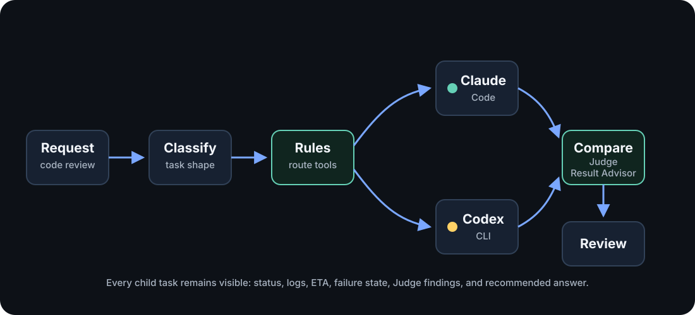

When a Model Context Protocol (MCP) client starts a high-level run, Ennodia
turns one request into a visible orchestration. The normal entrypoint is
`ennodia_run`. Lower-level task and Compare tools stay available for debugging
and manual control.

## Pipeline at a Glance

| Stage | What happens | Main tools |
| --- | --- | --- |
| Discover | Ennodia finds installed agent command-line interface (CLI) programs and reports the runnable state of each harness. | `ennodia_list_harnesses` |
| Plan | The router uses a caller-provided category when supplied, otherwise a keyword fallback, then chooses candidate harnesses. | `ennodia_plan`, `ennodia_run` |
| Advise (optional) | A Plan Advisor proposes a bounded set of harness, model, and skill assignments as inert data. Ennodia validates it but does not launch it. | `ennodia_start_plan_advice`, `ennodia_get_plan_advice` |
| Budget | Ennodia estimates preflight input tokens and checks optional local limits on that estimate. | `ennodia_estimate_budget`, `ennodia_run` |
| Execute | Thin adapters start the selected local agent CLI commands. Each child has a default 5-minute timeout and a 1-hour maximum accepted by the public tools. | `ennodia_start`, `ennodia_run` |
| Watch | Child task status, stdout, stderr, timing, and failures stay inspectable. | `ennodia_get_task`, `ennodia_get_run` |
| Recover | Ennodia reports timeouts, cancellations, and failed children without hiding them. | `ennodia_cancel_task`, `ennodia_cancel_run` |
| Compare | The Judge maps successful outputs. The Result Advisor uses those findings to recommend an answer. Compare adds two serial model passes after child agents finish. | `ennodia_start_compare`, `ennodia_get_compare` |
| Return | The MCP client receives one final answer plus an inspectable run record and durable terminal receipt. | `ennodia_get_run`, `ennodia_history` |

## Discover

Ennodia maintains a registry of execution backends. Each adapter is intentionally
thin. It reports tool availability, identifies the installed version, and starts
the tool through its supported command-line surface.

See [Supported Harnesses](/docs/reference/supported-harnesses/) for current
adapter IDs and setup notes.

## Plan

The router combines the currently available harnesses with either a
caller-provided category (`code`, `research`, `browser`, `image`, or `general`)
or a small keyword fallback. Pass `category` when you know the work type. The
fallback is a convenience
path, not a claim of deep intent understanding.

## Plan Advisor

Plan Advisor is an optional suggestion path, not a more powerful router. It sees
a frozen, bounded inventory and proposes explicit worker slices with harness,
model, and skill assignments. Its response is untrusted plan data: it cannot set
working directories, environment variables, commands, permissions, timeouts,
or budgets. The Plan Advisor task itself runs in a separate empty temporary working
directory rather than inheriting the target project directory.

Ennodia parses the complete response as strict JSON and validates every
assignment. A valid result is still inert. The Plan Advisor never starts worker
tasks, retries them, or changes the plan after validation. The caller must make
a separate `ennodia_start_advised_plan` call with the exact plan digest. Each
advice result can authorize one launch.

Immediately before the first launch, Ennodia checks the digest, current
inventory, skills, caller model allowlists, and budget again. Any mismatch fails
closed with zero worker launches. Provider model availability remains
unverified until its harness runs.

## Budget

Before a high-level run starts child tasks, Ennodia can estimate the input-token
budget. The estimate includes selected child task count, prompt input, planned
Compare input, and the effective candidate bound used in the Judge prompt.

Budget checks are intentionally honest. Ennodia can enforce local preflight
limits such as `maxChildTasks` and `maxEstimatedInputTokens` on that estimate.
Child-task estimates exclude harness system prompts, file reads, tool loops, and
provider-side context, so real usage can be higher. Ennodia only reports
subscription quota as known when a supported local CLI or application
programming interface (API) surface exposes it.

See [Budgets and Limits](/docs/guides/budgets-and-limits/) for request shapes.

## Execute

Each node in the graph is dispatched through a thin adapter. Ennodia keeps the
shared task lifecycle outside the adapter: process start, output capture,
timeout handling, cancellation, and terminal status all live in core modules.

Expect this stage to take minutes, not seconds. Every child task launches a real
agent CLI. The default per-task timeout is 5 minutes, and public tool schemas
cap requested timeouts at 1 hour.

## Watch

Every external command becomes a tracked child task. A task is not terminal until
the child process exits and captured output has drained.

## Recover

Failure handling is part of the execution plan. Nodes can time out, fail, enter
the `cancelled` state, or return partial output without hiding the result.

## Compare

When multiple agents produce answers, Ennodia does not concatenate them. A Judge
can produce a structured comparison: agreements, contradictions, unique
insights, blind spots, and risks. The Result Advisor then uses that comparison
and the original outputs to create the recommended result.

Compare uses model judgment. It does not use formal voting or consensus.

Compare is also serial: the Judge task runs first, then the Result Advisor task
runs after it completes. If the Judge fails or returns unusable structured
analysis, the Result Advisor can continue directly from the candidate outputs.
The result records `basis: "candidates-only"` so the degraded path stays
visible. For a parallel run with N child agents, count N child runs plus the two
Compare passes when estimating budget and latency.

## Return

The MCP client receives the final output and can inspect live in-memory state
while the MCP server process remains alive. Terminal run snapshots are also
written under `~/.ennodia/history/` by default, capped to the most recent 500
runs. Set `ENNODIA_HISTORY=0` to opt out or `ENNODIA_HISTORY_DIR` to choose a
different local directory.
