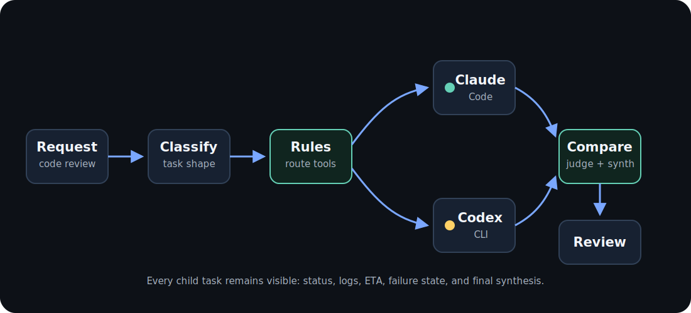

When an MCP client submits a high-level run, Ennodia processes it through a
visible orchestration pipeline. The `ennodia_run` tool is the current end-to-end
entrypoint. Lower-level task and Compare tools stay available for debugging and
manual control.

### 1. Discover

Ennodia maintains a registry of execution backends — see the current adapter
list in [MCP tools](/docs/reference/mcp-tools/). Each adapter is intentionally
thin: it reports whether the tool is available, identifies the installed
version, and starts the tool through its supported command-line surface.

### 2. Plan

The router combines prompt classification and the currently available harnesses
to decide where work should go.

For example:

### 3. Budget

Before a high-level run starts child tasks, Ennodia can estimate the input-token
budget. The estimate includes selected child task count, prompt input, planned
Compare input, and the `maxOutputChars` bound used for successful task outputs.

Budget checks are intentionally honest. Ennodia can enforce local preflight
limits such as `maxChildTasks` and `maxEstimatedInputTokens`. It only reports
subscription quota as known when a supported local CLI/API surface exposes it.

### 4. Execute

Each node in the graph is dispatched through a thin adapter. Ennodia keeps the
shared task lifecycle outside the adapter: process start, output capture,
timeout handling, cancellation, and terminal status all live in core modules.

### 5. Watch

Every external command becomes a tracked child task. A task is not terminal until
the child process exits and captured output has drained.

### 6. Recover

Failure handling is part of the execution plan. Nodes can time out, fail, be
cancelled, or return partial output without hiding what happened.

### 7. Compare

When several agents produce answers, Ennodia does not concatenate them. A judge
can produce a structured comparison: agreements, contradictions, unique
insights, blind spots, and risks. A synthesizer then uses that comparison and
the original outputs to create the final result. The comparison is done by a
model; the user can inspect the trace, but does not need to manually grade every
child answer.

### 8. Return

The MCP client receives the final output and can inspect the in-memory run
record while the MCP server process remains alive.
